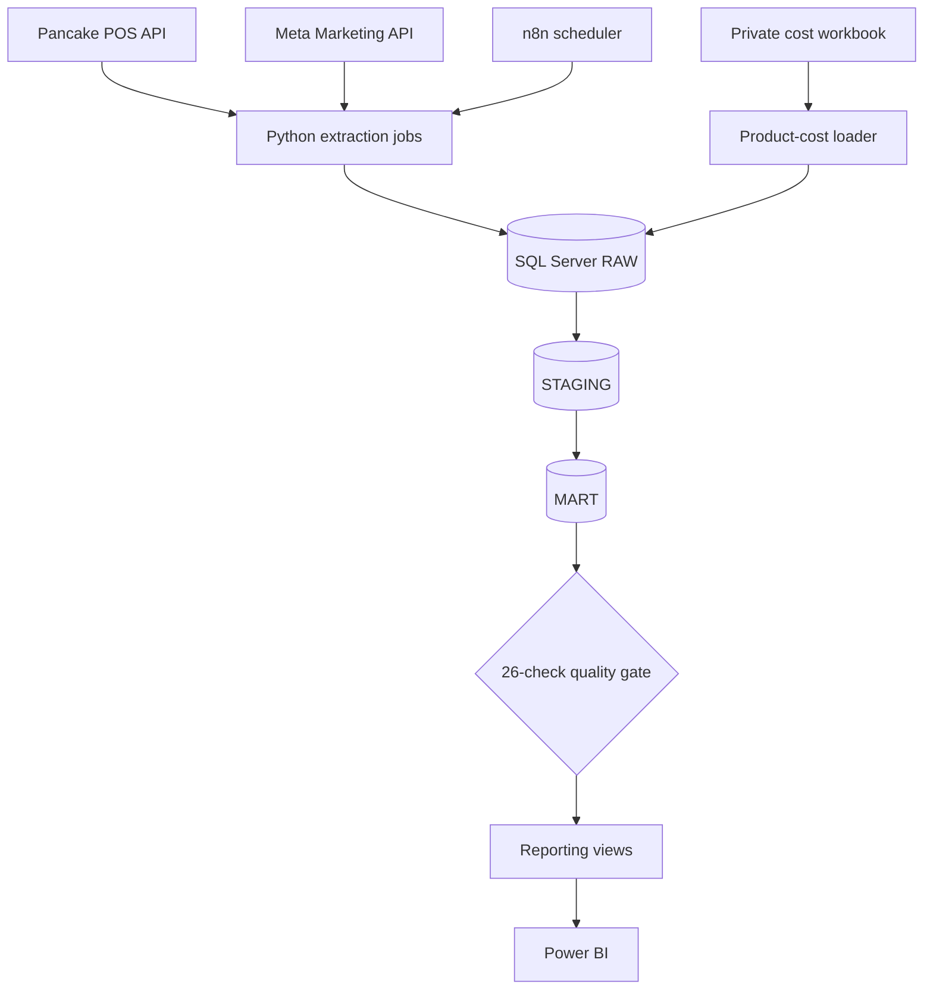

# E-commerce Analytics Pipeline

An end-to-end analytics engineering project that combines e-commerce orders, Meta Ads performance, product costs, and shipping rules into a governed SQL Server model for Power BI reporting.

The project demonstrates how raw operational and advertising data can be transformed into decision-ready metrics while preserving data lineage, business rules, security, and automated quality controls.

## Business questions

The analytical model is designed to answer questions such as:

- Which campaigns and ads generate the most recognized revenue?
- Which advertising accounts achieve the lowest cost per acquired order?
- Which products lose money after product cost, shipping cost, and advertising spend?
- How do projected and recognized profitability differ?
- Which orders, ads, and products are included in the reporting scope?
- Where are missing, fallback, or estimated product costs affecting confidence in profitability?

## Architecture



### Technology stack

- Python 3.11
- `uv` for dependency and environment management
- SQL Server with ODBC Driver 18
- n8n for local orchestration and scheduling
- Power BI Desktop
- Git and GitHub for version control and documentation

V1 deliberately avoids Docker, Airflow, Snowflake, and dbt so that the project remains reproducible on a Windows analytics workstation.

## Data model

The warehouse follows a `RAW -> STAGING -> MART -> REPORTING` design.

### RAW

RAW tables preserve source payloads and import metadata before business transformations are applied.

- Pancake order versions and order items
- Meta account snapshots and daily ad-insight versions
- Product-cost workbook batches, master rows, and cost-history rows
- Pipeline run and extraction-control metadata

### STAGING

STAGING produces typed, normalized, and deduplicated records.

- Pancake orders and items
- Meta accounts and daily insights
- Product-cost master and effective-dated cost history
- Manual product-cost estimates
- Resolved order-item costs with history, fallback, estimate, and missing-cost flags

### MART

The MART layer stores reusable business entities and economic facts.

| Model | Grain | Purpose |
|---|---|---|
| `order_economics` | One row per order | Projected and recognized order profitability |
| `order_item_economics` | One row per order item | Product revenue allocation and resolved COGS |
| `ad_economics_daily` | One row per date and ad | Ad spend, attributed orders, revenue, and contribution |
| `product_ad_economics_daily` | One row per date, ad, and product | Product-level allocation of advertising cost and profit |
| `dim_meta_ads` | One row per advertising entity | Meta hierarchy and unattributed members |
| `dim_products` | One row per canonical product | Product mapping and unattributed members |
| `dim_date` | One row per date | Calendar attributes for reporting |

Business-scope rule tables assign orders and ads to in-scope or out-of-scope reporting populations without deleting source data.

## Business logic

Important calculations are implemented in SQL rather than embedded only in Power BI.

- Meta spend is converted to actual advertising cost through effective-dated tax rules.
- Product cost is resolved by order date using cost history, then controlled fallback and estimate rules.
- A zero-priced order item may still carry product cost.
- Shipping and return fees are controlled through effective-dated carrier rules.
- Projected metrics support operational monitoring of in-progress orders.
- Recognized revenue and profit are restricted to qualifying finalized business events.
- Order-level revenue, discount, shipping, and contribution values reconcile to allocated item-level facts.
- Advertising cost allocated to products reconciles to ad-level actual advertising cost.
- Unmapped records remain visible through explicit unattributed members.

Rules are stored in database tables so policy changes can be audited and applied by effective date.

## Data quality gate

Every successful daily pipeline run must pass 26 automated checks in [`sql/04_quality/001_validate_daily_pipeline.sql`](sql/04_quality/001_validate_daily_pipeline.sql).

The gate validates:

- STAGING-to-MART record coverage
- date-dimension coverage
- order and ad scope assignments
- Meta tax and actual-ad-cost formulas
- projected and recognized revenue formulas
- product-cost completeness
- prevention of premature revenue recognition
- item-to-order revenue reconciliation
- product-to-ad cost reconciliation
- projected and recognized contribution reconciliation
- reporting treatment of out-of-scope records

Any failed check returns a non-zero process exit code. n8n records the execution as failed instead of silently publishing incomplete economics.

## Repository structure

```text
ecommerce-analytics-pipeline/
|-- jobs/
|   |-- backfill/              # Historical Pancake and Meta extraction
|   `-- incremental/           # Daily extraction and orchestration
|-- n8n/workflows/             # Sanitized workflow exports
|-- powerbi/                   # Sanitized previews; real PBIX is ignored
|-- sql/
|   |-- 00_bootstrap/          # Database and schemas
|   |-- 01_raw/                # Immutable source-oriented tables
|   |-- 02_staging/            # Typed and normalized models
|   |-- 03_mart/               # Dimensions, facts, and economic rules
|   |-- 04_quality/            # Automated quality gate
|   `-- 05_reporting/          # Power BI-facing views
|-- src/ecommerce_analytics/
|   |-- clients/               # API and SQL Server clients
|   |-- extractors/            # Source extraction logic
|   |-- loaders/               # Idempotent RAW loading
|   |-- quality/               # Quality utilities
|   |-- transformers/          # Source normalization
|   `-- settings.py            # Environment-based configuration
|-- tests/                     # Unit tests
|-- .env.example               # Safe configuration template
|-- pyproject.toml
`-- uv.lock
```

## Local setup

### Prerequisites

- Windows 10 or 11
- Python 3.11
- [`uv`](https://docs.astral.sh/uv/)
- SQL Server
- Microsoft ODBC Driver 18 for SQL Server
- n8n 2.x
- Power BI Desktop

### 1. Clone and install dependencies

```powershell
git clone https://github.com/VuHongVi/ecommerce-analytics-pipeline.git
cd ecommerce-analytics-pipeline
uv sync --dev
```

### 2. Create local configuration

```powershell
Copy-Item ".env.example" ".env"
```

Populate `.env` with local API and SQL Server settings. Never commit `.env`, access tokens, source workbooks, API payloads, customer data, or database backups.

### 3. Create the warehouse

Execute the SQL scripts in numeric folder and filename order:

```text
00_bootstrap -> 01_raw -> 02_staging -> 03_mart -> 04_quality -> 05_reporting
```

Use SQL Server Management Studio or another client that supports SQL Server batch syntax.

### 4. Review job options

```powershell
uv run python "jobs/backfill/pancake_orders.py" --help
uv run python "jobs/backfill/meta_ads.py" --help
uv run python "jobs/incremental/daily_pipeline.py" --help
```

Historical backfills should be completed before enabling the daily workflow.

## Daily operation

Run the complete daily pipeline:

```powershell
uv run python "jobs/incremental/daily_pipeline.py" --allow-partial-extracts
```

Use partial-extract acceptance only when inaccessible sources are understood and intentionally excluded from the analytical scope.

Refresh SQL models and run quality checks without calling source APIs:

```powershell
uv run python "jobs/incremental/daily_pipeline.py" --sql-only
```

Run only the quality gate:

```powershell
uv run python "jobs/incremental/daily_pipeline.py" --quality-only
```

The pipeline is idempotent: rerunning unchanged source versions should not duplicate analytical records.

## n8n orchestration

The sanitized workflow export is available at [`n8n/workflows/ecommerce_daily_pipeline.json`](n8n/workflows/ecommerce_daily_pipeline.json).

The workflow contains manual and scheduled triggers connected to the daily pipeline command. Local n8n requires these environment variables:

```powershell
$env:NODES_EXCLUDE = '[]'
$env:GENERIC_TIMEZONE = 'Asia/Ho_Chi_Minh'
$env:ECOMMERCE_ANALYTICS_ROOT = '<local-repository-path>'
$env:UV_EXECUTABLE = '<path-to-uv-executable>'
n8n start
```

`Execute Command` is intentionally enabled only for local self-hosted n8n. Do not expose an instance with operating-system command execution to the public internet.

The workflow committed to GitHub has `active: false` so importing it cannot trigger a pipeline accidentally.

## Power BI

The Power BI model connects to views in `sql/05_reporting` rather than reading raw API files directly.


[View the sanitized dashboard PDF](powerbi/ecommerce_analytics_dashboard.pdf)

The real `.pbix` uses Import storage and may contain internal data, so it is excluded from Git. Only sanitized previews should be committed before the repository is made public.

## Testing and code quality

```powershell
uv run pytest
uv run ruff check .
git diff --check
```

The repository uses Ruff for formatting and linting, and pytest for unit tests around settings and Pancake order transformation behavior.

## Security and privacy

- Secrets are loaded from environment variables through a local `.env` file.
- Real order exports, API payloads, source workbooks, logs, database files, and PBIX files are excluded from Git.
- Customer names, phone numbers, addresses, tokens, account IDs, and private business metrics must never be committed.
- The n8n export references environment variables instead of workstation-specific paths.
- Public screenshots and PDFs must use masked or synthetic business information.
- Effective-dated rules preserve reproducibility without exposing confidential source data.

## Current V1 status

- Pancake historical and incremental extraction
- Meta Ads historical and incremental extraction
- SQL Server RAW, STAGING, MART, QUALITY, and REPORTING layers
- effective-dated tax, shipping, product-cost, and business-scope rules
- projected and recognized profitability models
- idempotent daily orchestration
- 26-check blocking quality gate
- n8n manual and daily scheduling workflow
- Power BI reporting views and dashboard preview

## Roadmap

Potential V2 improvements include:

- formal alerting for failed n8n executions
- automated ingestion of private product-cost workbook updates
- incremental Power BI refresh
- CI checks for Python, SQL, and sanitized workflow artifacts
- synthetic demo data for a fully public interactive portfolio
- additional attribution methods and campaign-level profitability analysis

## Disclaimer

This repository is a portfolio implementation based on a real operational analytics problem. Public artifacts must contain only sanitized, aggregated, or synthetic information. Business rules and sample outputs are provided for educational demonstration and do not disclose private customer or company data.
